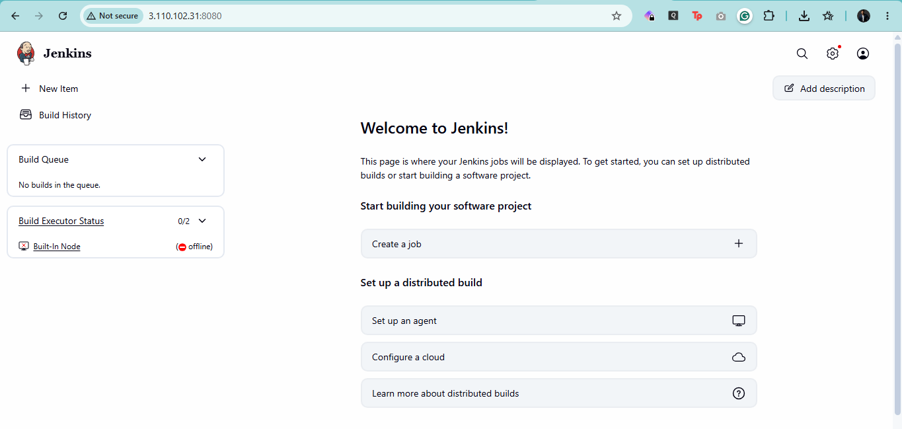
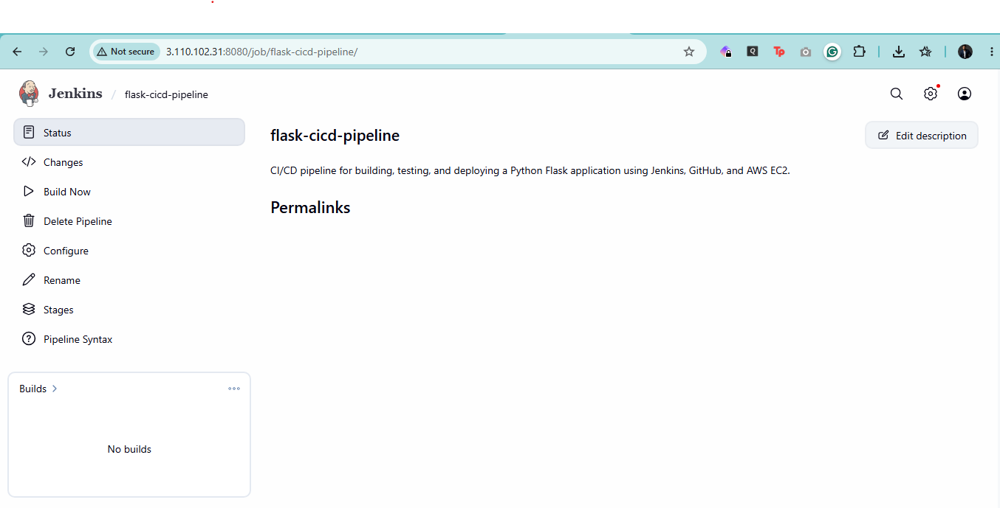
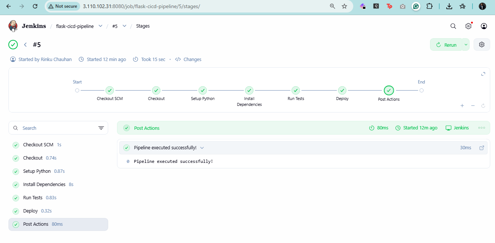
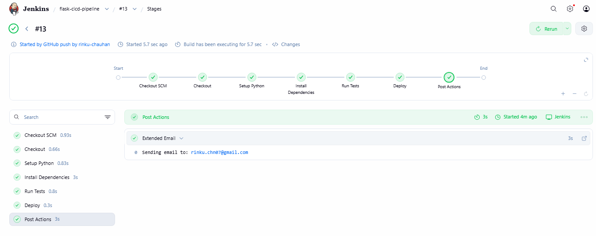
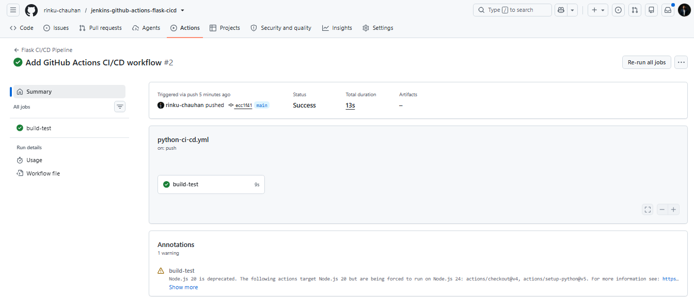
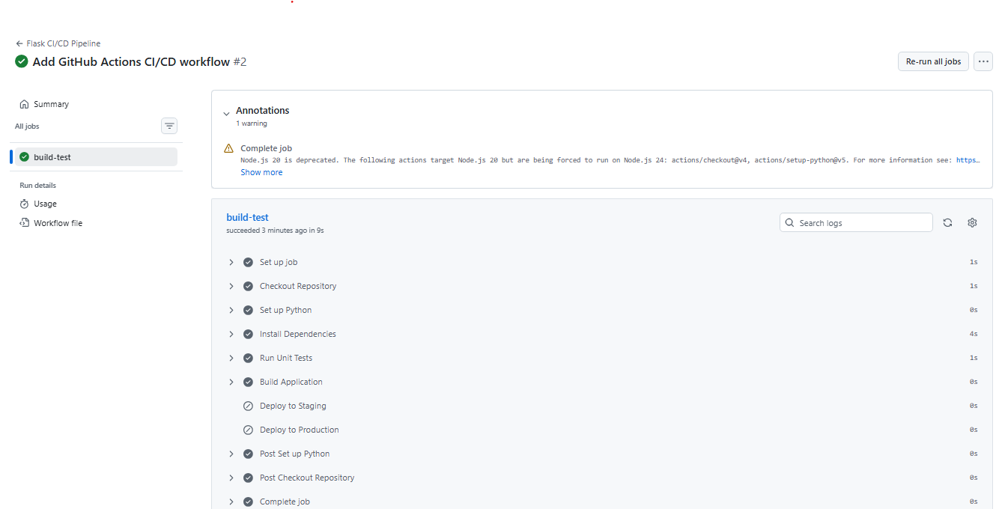
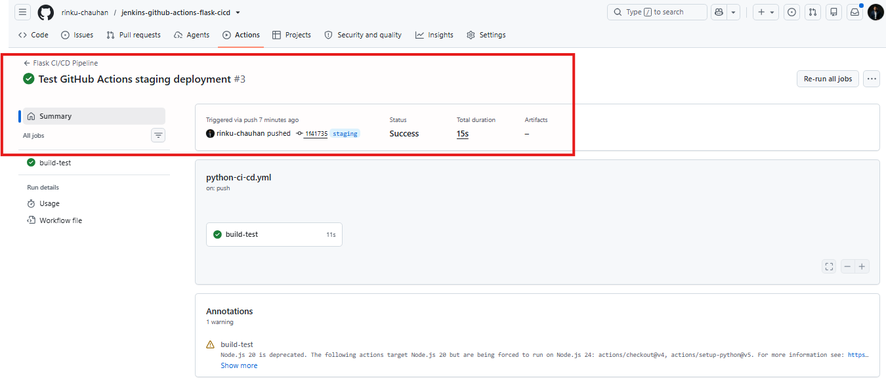
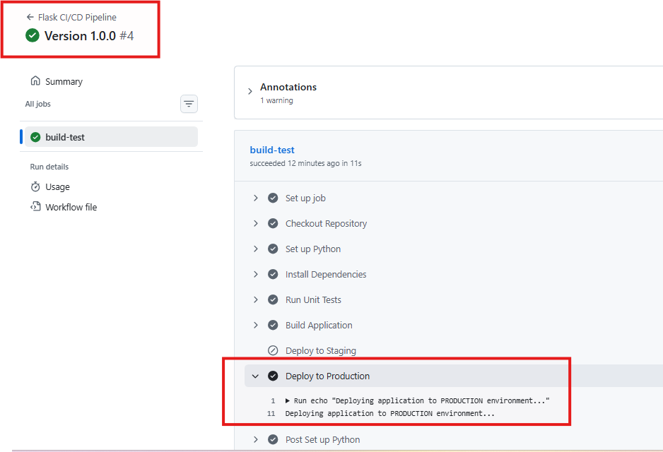
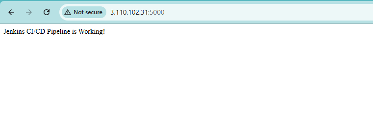

# 🚀 End-to-End CI/CD Pipeline for Flask Application using Jenkins & GitHub Actions


---

# 📖 Project Overview

This project demonstrates an **end-to-end CI/CD pipeline** for a Python Flask application using **Jenkins**, **GitHub Actions**, and **AWS EC2**.

The project showcases modern DevOps practices including:

- Continuous Integration using Jenkins
- Automated testing with Pytest
- GitHub Webhook integration
- Email notifications on build success and failure
- GitHub Actions workflow automation
- Branch-based staging deployments
- Release-based production deployments
- Secure secret management using GitHub Secrets

The implementation follows a practical workflow similar to what is commonly used in real-world DevOps environments.

---

# ✨ Key Features

- ✅ Jenkins Declarative Pipeline
- ✅ GitHub Webhook Integration
- ✅ Automatic Build Trigger
- ✅ Python Virtual Environment
- ✅ Dependency Installation
- ✅ Automated Unit Testing (Pytest)
- ✅ Flask Application Deployment
- ✅ Email Notifications (Success & Failure)
- ✅ GitHub Actions CI Pipeline
- ✅ GitHub Secrets Integration
- ✅ Branch-based Staging Deployment
- ✅ Release-based Production Deployment
- ✅ AWS EC2 Hosting

---

# 🏗️ Architecture Overview

```text
                         Developer
                             │
                       Git Push / Release
                             │
                             ▼
                    GitHub Repository
                             │
         ┌───────────────────┴────────────────────┐
         │                                        │
         ▼                                        ▼
  GitHub Webhook                         GitHub Actions
         │                                        │
         ▼                                        ▼
     Jenkins CI                         Build • Test • Validate
         │                                        │
         ▼                                        │
 Deploy Flask Application                         │
      AWS EC2 Instance                            │
         │                                        │
         └───────────────────┬────────────────────┘
                             ▼
                  Email Notifications
                  (Success / Failure)
                             │
                             ▼
             Staging / Production Deployment
```

---

# 🛠️ Technology Stack

| Category | Technology |
|-----------|------------|
| Programming Language | Python |
| Framework | Flask |
| CI Tool | Jenkins |
| CI/CD | GitHub Actions |
| Version Control | Git & GitHub |
| Cloud | AWS EC2 |
| Operating System | Ubuntu |
| Testing | Pytest |
| Notifications | Gmail SMTP |
| IDE | Visual Studio Code |

---

# 📂 Repository Structure

```text
.
├── .github/
│   └── workflows/
│       └── python-ci-cd.yml
├── assets/
├── app.py
├── Jenkinsfile
├── requirements.txt
├── test_app.py
├── README.md
└── LICENSE
```

---

# ⚙️ CI/CD Workflow

1. Developer pushes code to GitHub.
2. GitHub Webhook automatically triggers Jenkins.
3. Jenkins:
   - Checks out the latest code
   - Creates a Python virtual environment
   - Installs project dependencies
   - Runs automated unit tests
   - Deploys the Flask application
   - Sends email notifications on success or failure
4. GitHub Actions:
   - Runs on pushes to `main` and `staging`
   - Executes automated testing
   - Deploys to the staging environment on the `staging` branch
   - Deploys to the production environment when a GitHub Release is published

---

# 🌿 Branching Strategy

| Branch | Purpose |
|----------|---------|
| `main` | Stable production-ready code |
| `staging` | Staging deployment testing |

Production deployment is triggered by publishing a GitHub Release.

---

# 📸 Project Walkthrough

## Jenkins Dashboard



---

## Jenkins Pipeline



---

## Successful Jenkins Pipeline



---

## GitHub Webhook Trigger


---

## Jenkins Email Notification



---

## GitHub Actions Workflow



---

## GitHub Actions Details



---

## Staging Deployment



---

## Production Deployment



---

## Flask Application Running



---

# 🎯 Learning Outcomes

This project helped me gain practical experience with:

- Jenkins Declarative Pipelines
- GitHub Webhooks
- Continuous Integration (CI)
- Continuous Delivery concepts
- GitHub Actions workflows
- GitHub Secrets
- Branching strategies
- Release management
- AWS EC2 deployments
- Python virtual environments
- Automated testing with Pytest
- SMTP email notifications
- DevOps workflow automation

---

# 🚀 Future Improvements

- Deploy using Docker containers
- Configure Nginx as a reverse proxy
- Implement HTTPS using Let's Encrypt
- Deploy using Kubernetes
- Integrate SonarQube for code quality analysis
- Add Infrastructure as Code using Terraform
- Implement Monitoring with Prometheus & Grafana

---

# 👨‍💻 Author

**Rinku Chauhan**

- LinkedIn: https://linkedin.com/in/rinku-chauhan
- GitHub: https://github.com/rinku-chauhan

---